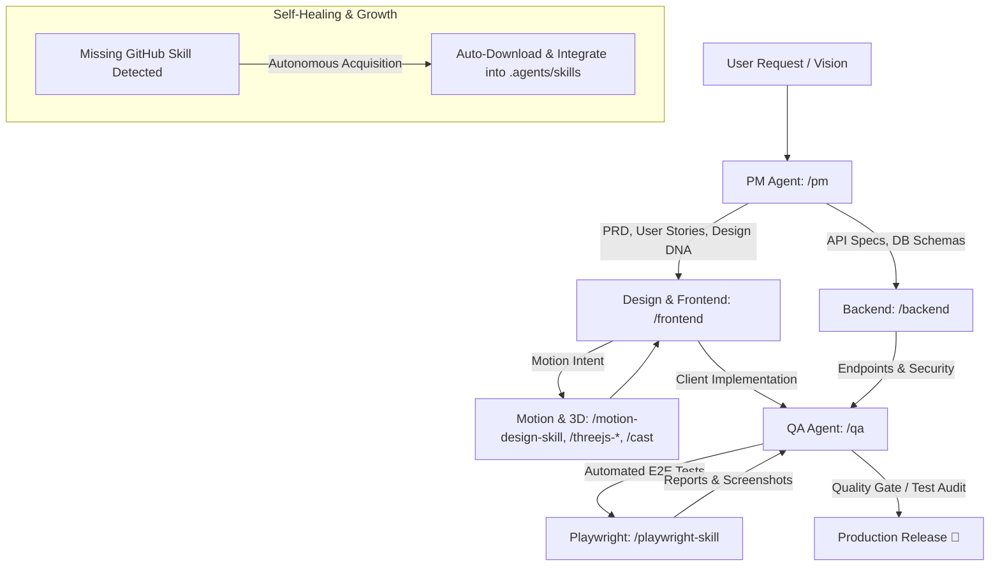

# Agent Skill Repository 🚀

> **Comprehensive Custom AI Agent Skills** for Software Development Life Cycle (SDLC) — Product Management, Backend Engineering, Frontend Engineering (Next.js & Vue 3 / Nuxt 3), Quality Assurance, and Graphify Knowledge Graph.

Created and maintained by **Ahmad Arif**.

---

## 📚 Included Custom Skills

This repository contains production-grade AI Agent Skills designed for autonomous and collaborative software engineering:

### 🌟 Core Roles
| Skill | Role / Function | Key Capabilities & Architecture |
|---|---|---|
| 📋 [**PM (Product Manager)**](./skills/pm) | Product Requirements & Architecture | • **Documentation Only (No Code Writing)**<br>• PRD Creation & Feature Breakdown (MoSCoW)<br>• Architecture Decision: Customer Portal (Nuxt 3 SSR) vs Operations Portal (Vue 3 SPA)<br>• Real-Time Concurrency Specs (Server-Authoritative Lock, Hold Timer, Teardown)<br>• Mandatory Admin/App Auth Planning<br>• Dynamic Master Data & Unambiguous Flow Design |
| ⚙️ [**Backend Engineer**](./skills/backend) | Server, API & Database | • **Express JS + Prisma ORM + Supabase DB & Storage**<br>• **Redis Atomic Locking** (`SET ... NX EX`) & Safe Release Lua Scripts<br>• Better Auth + JWT Token Rotation & RBAC<br>• Multi-Client Interoperability (Next.js, Vue 3 SPA, Nuxt 3)<br>• Teardown Beacon Endpoints (`navigator.sendBeacon` & `keepalive`)<br>• Safe Logic Flow (Guard Clause & Result Pattern) |
| 🎨 [**Frontend Engineer**](./skills/frontend) | UI/UX & Client Applications | • **Dual Ecosystem**: Next.js (React) & Vue 3 / Nuxt 3 (Vite + Pinia)<br>• **Vertical Slice Architecture** (`app`, `modules`, `shared`) & Clean Patterns (Repository, Adapter)<br>• **Real-Time Resilient Connection**: Auto-reconnect WebSocket + Fallback Short Polling<br>• **Smooth 60fps Geo-Tracking**: MapLibre/Mapbox LERP + Bearing Calculation<br>• **Teardown Beacons**: Graceful lock release on tab close (`pagehide` beacon)<br>• **UI/UX Pro Max Intelligence** (50+ styles, 97 palettes, 57 font pairings) |
| 🧪 [**QA (Quality Assurance)**](./skills/qa) | Testing, Security & Quality Audit | • Early PM-QA Shift-Left Alignment<br>• **Race Condition & Concurrency Testing**: Multi-user lock contention & Redis TTL verification<br>• **Resilience Audit**: WebSocket drop to polling fallback verification<br>• **Performance Audit**: 60fps LERP Map Tracking & Memory Leak checks in `onUnmounted`<br>• Unit & E2E Testing (Vitest, Vue Test Utils, Playwright Automation) |
| 🌐 [**Graphify**](./skills/graphify) | Knowledge Graph & Codebase Mapping | • Persistent Codebase Knowledge Graph<br>• God Nodes & Community Detection<br>• Query, Path Extraction & Codebase Explanations |

---

## 🌍 External 3rd-Party Skills Integrated

This ecosystem is enhanced with specialized external skills sourced from GitHub and fully integrated into the core agents (`/pm`, `/qa`, `/backend`, `/frontend`):

| External Skill | Source / Package | Purpose / Capabilities |
|---|---|---|
| 🎭 [**Playwright Skill**](./skills/playwright-skill) | `lackeyjb/playwright-skill` | General-purpose browser automation, visual testing, responsive screenshots, multi-step flow execution, and dev-server auto-detection. |
| 🎬 [**Motion Design**](./skills/motion-design-skill) | `LottieFiles/motion-design-skill` | Standardizes easing curves, choreography, motion layers, and UI feedback states. |
| 🧊 [**Three.js Skills**](./skills/threejs-fundamentals) | `pinkforest/threejs-playground` | 10 specialized skills (`threejs-fundamentals`, `threejs-geometry`, `threejs-materials`, `threejs-lighting`, `threejs-textures`, `threejs-animation`, `threejs-loaders`, `threejs-shaders`, `threejs-postprocessing`, `threejs-interaction`) for 3D/WebGL rendering, asset pipelines, and performance audits. |
| 🧬 [**Design DNA**](./skills/design-dna) | `zanwei/design-dna` | Extracts, structures, and enforces visual design identity (Design Tokens JSON, qualitative style, effects) from reference screenshots/URLs. |
| 🎭 [**Genjutsu**](./skills/cast) | `AThevon/genjutsu` | Creative coding suite featuring `/cast` (The Illusionist) for micro-interactions & motion and `/paint` (The Master Painter) for bootstrapping entire visual universes + audits. |

---

## 🔄 Agent Collaboration Workflow



---

## 🛠️ Standard Project Tech Stack

All skills are configured to work seamlessly together under these unified tech stacks:

- 💻 **Frontend Ecosystems**:
  - **React Stack**: Next.js (App Router) + PWA + Tailwind CSS + Zustand + Shadcn UI + Untitled UI + Framer Motion
  - **Vue Stack**: Vue 3 (Vite SPA/PWA) / Nuxt 3 (SSR) + Tailwind CSS + Pinia + TanStack Query + Shadcn Vue + Nuxt UI + Vue Transitions
- 🎬 **Animations & 3D**: Framer Motion + AnimeJS + Animate UI + Three.js + Genjutsu (`/cast`, `/paint`)
- ⚙️ **Backend**: Express JS (TypeScript / Node.js) with CORS support for Vite (`5173`) & Next/Nuxt (`3000`)
- 🗄️ **Database & Storage**: Supabase PostgreSQL + Supabase Bucket Storage
- ⚡ **Distributed Locking & Caching**: Redis / Upstash Redis (`SET ... NX EX` & Lua scripts)
- 🛠️ **ORM**: Prisma ORM (`prisma/schema.prisma`)
- 🔐 **Auth & Security**: Better Auth + JWT Token (Access/Refresh Token Rotation & RBAC)
- 🧪 **Testing & Automation**: Vitest (Unit) + Vue Test Utils + Playwright (`/playwright-skill` E2E)
- 🗺️ **Maps & Routing**: Google Maps Platform / Mapbox GL JS / OSRM + Leaflet / MapLibre (with LERP tracking)
- 🌿 **Git Workflow**: GitHub with `dev` branch (Development) & `main` branch (Production Release)
- 🚀 **Deployment**: Vercel
- 📝 **Prompting Framework**: 5-Step T-C-R-E-I Framework (Task, Context, References, Evaluate, Iterate)

---

## 📁 Repository Structure

```
agent-skill/
├── README.md
├── LICENSE
├── skills/                      # Production Skill Folders
│   ├── pm/                      # Product Manager Skill & Reference Guides
│   ├── backend/                 # Backend Engineer Skill & Reference Guides
│   ├── frontend/                # Frontend Engineer (Next.js & Vue 3 / Nuxt 3)
│   │   └── references/
│   │       ├── vue-development-guide.md     # Vue 3 / Nuxt 3 Config & Setup Guide
│   │       ├── enterprise-vue-patterns.md   # Vertical Slice, Real-Time & High Concurrency
│   │       └── ...
│   ├── qa/                      # Quality Assurance Skill & Testing Guides
│   ├── graphify/                # Graphify Skill & Knowledge Graph Spec
│   ├── playwright-skill/        # Playwright Browser Automation Skill
│   ├── motion-design-skill/     # Motion Design Skill (LottieFiles)
│   ├── design-dna/              # Design DNA Extraction & Generation Skill
│   ├── cast/                    # Genjutsu: The Illusionist (/cast)
│   ├── paint/                   # Genjutsu: The Master Painter (/paint)
│   ├── _jutsu/                  # Genjutsu internal sub-skills (Web, iOS, Android)
│   └── threejs-*/               # 10 Three.js skills (fundamentals, geometry, shaders, etc.)
└── .agents/                     # Local Workspace Discovery Root
    └── skills/                  # Auto-discovered skills for AI Agents
        ├── pm/
        ├── backend/
        ├── frontend/
        ├── qa/
        ├── graphify/
        ├── playwright-skill/
        ├── motion-design-skill/
        ├── design-dna/
        ├── cast/
        ├── paint/
        ├── _jutsu/
        └── threejs-*/
```

---

## 🚀 How to Install & Use

### Option 1: Global Installation (All Projects)
Copy the skills to your global agent config directory:

```bash
# Windows (PowerShell)
Copy-Item -Path ".\skills\*" -Destination "$env:USERPROFILE\.gemini\config\skills" -Recurse -Force
```

### Option 2: Workspace Installation (Single Project)
Copy the `.agents/skills` directory into your project workspace root:

```bash
# Copy to project workspace
cp -r .agents /path/to/your/project/
```

---

## 📄 License

This project is licensed under the **MIT License** — see the [LICENSE](./LICENSE) file for details.

Copyright (c) 2026 **Ahmad Arif**.
