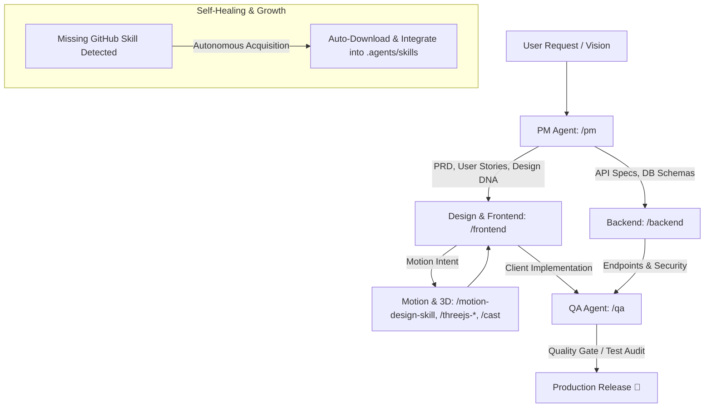

# Agent Skill Repository 🚀

> **Comprehensive Custom AI Agent Skills** for Software Development Life Cycle (SDLC) — Product Management, Backend Engineering, Frontend Engineering, Quality Assurance, and Graphify Knowledge Graph.

Created and maintained by **Ahmad Arif**.

---

## 📚 Included Custom Skills

This repository contains production-grade AI Agent Skills designed for autonomous and collaborative software engineering:

### 🌟 Core Roles
| Skill | Role / Function | Key Capabilities & Architecture |
|---|---|---|
| 📋 [**PM (Product Manager)**](./skills/pm) | Product Requirements & Architecture | • **Documentation Only (No Code Writing)**<br>• PRD Creation & Feature Breakdown (MoSCoW)<br>• Mandatory Admin/App Auth Planning<br>• Early QA Shift-Left Alignment<br>• Dynamic Master Data & Unambiguous Flow Design |
| ⚙️ [**Backend Engineer**](./skills/backend) | Server, API & Database | • **Express JS + Prisma ORM + Supabase DB & Storage**<br>• Better Auth + JWT Token Rotation & RBAC<br>• Centralized Global Error Handler & Custom Exceptions<br>• Safe Logic Flow (Guard Clause & Result Pattern)<br>• Route Proxy API for Maps (Google/Mapbox/OSRM) |
| 🎨 [**Frontend Engineer**](./skills/frontend) | UI/UX & Client Applications | • **Next.js + PWA + Tailwind CSS + Zustand**<br>• **UI/UX Pro Max Design Intelligence** (50+ styles, 97 palettes, 57 font pairings)<br>• Component Setup: Shadcn UI + Untitled UI + Animate UI<br>• Animations: Framer Motion + AnimeJS<br>• **Device Priority**: 📱 Mobile (HP) & Tablet/iPad → 💻 Desktop<br>• Protected Routes & Admin Auth Guard |
| 🧪 [**QA (Quality Assurance)**](./skills/qa) | Testing, Security & Quality Audit | • Early PM-QA Shift-Left Alignment<br>• Zero Hardcode Master Data Audit<br>• Data Misconception & Edge Case Testing<br>• Security Audit (OWASP, Auth, RBAC, IDOR, API Key leaks)<br>• Unit & E2E Testing (Vitest, Playwright) |
| 🌐 [**Graphify**](./skills/graphify) | Knowledge Graph & Codebase Mapping | • Persistent Codebase Knowledge Graph<br>• God Nodes & Community Detection<br>• Query, Path Extraction & Codebase Explanations |

---

## 🌍 External 3rd-Party Skills Integrated

This ecosystem is enhanced with specialized external skills sourced from GitHub and fully integrated into the core agents (`/pm`, `/qa`, `/backend`, `/frontend`):

| External Skill | Source / Package | Purpose / Capabilities |
|---|---|---|
| 🎬 **Motion Design** | `LottieFiles/motion-design-skill` | Standardizes easing curves, choreography, motion layers, and UI feedback states. |
| 🧊 **Three.js Skills** | `pinkforest/threejs-playground` | 10 specialized skills (`threejs-fundamentals`, `threejs-geometry`, `threejs-materials`, `threejs-lighting`, `threejs-textures`, `threejs-animation`, `threejs-loaders`, `threejs-shaders`, `threejs-postprocessing`, `threejs-interaction`) for 3D/WebGL rendering, asset pipelines, and performance audits. |
| 🧬 **Design DNA** | `zanwei/design-dna` | Extracts, structures, and enforces visual design identity (Design Tokens JSON, qualitative style, effects) from reference screenshots/URLs. |
| 🎭 **Genjutsu** | `AThevon/genjutsu` | Creative coding suite featuring `/cast` (The Illusionist) for micro-interactions & motion and `/paint` (The Master Painter) for bootstrapping entire visual universes + audits. |

---

## 🔄 Agent Collaboration Workflow



---

## 🛠️ Standard Project Tech Stack

All skills are configured to work seamlessly together under this unified tech stack:

- 💻 **Frontend**: Next.js (App Router) + PWA + Tailwind CSS + Zustand
- 🧩 **UI Components**: Shadcn UI (`npx shadcn@latest init`) + Untitled UI (`npx untitledui@latest init --nextjs`)
- 🎬 **Animations & 3D**: Framer Motion + AnimeJS + Animate UI + Three.js + Genjutsu (`/cast`, `/paint`)
- ⚙️ **Backend**: Express JS (TypeScript / Node.js)
- 🗄️ **Database & Storage**: Supabase PostgreSQL + Supabase Bucket Storage
- 🛠️ **ORM**: Prisma ORM (`prisma/schema.prisma`)
- 🔐 **Auth & Security**: Better Auth + JWT Token (Access/Refresh Token Rotation)
- 🗺️ **Maps & Routing**: Google Maps Platform / Mapbox GL JS / OSRM + Leaflet / MapLibre
- 🌿 **Git Workflow**: GitHub with `dev` branch (Development) & `main` branch (Production Release)
- 🚀 **Deployment**: Vercel
- 📝 **Prompting Framework**: 5-Step T-C-R-E-I Framework (Task, Context, References, Evaluate, Iterate)

---

## 📁 Repository Structure

```
agent-skill/
├── README.md
├── LICENSE
├── skills/                      # Production Skill Folders
│   ├── pm/                      # Product Manager Skill & Reference Guides
│   ├── backend/                 # Backend Engineer Skill & Reference Guides
│   ├── frontend/                # Frontend Engineer & UI/UX Pro Max Skill
│   ├── qa/                      # Quality Assurance Skill & Reference Guides
│   ├── graphify/                # Graphify Skill & Knowledge Graph Spec
│   ├── motion-design-skill/     # Motion Design Skill (LottieFiles)
│   ├── design-dna/              # Design DNA Extraction & Generation Skill
│   ├── cast/                    # Genjutsu: The Illusionist (/cast)
│   ├── paint/                   # Genjutsu: The Master Painter (/paint)
│   ├── _jutsu/                  # Genjutsu internal sub-skills (Web, iOS, Android)
│   └── threejs-*/               # 10 Three.js skills (fundamentals, geometry, shaders, etc.)
└── .agents/                     # Local Workspace Discovery Root
    └── skills/                  # Auto-discovered skills for AI Agents
        ├── pm/
        ├── backend/
        ├── frontend/
        ├── qa/
        ├── graphify/
        ├── motion-design-skill/
        ├── design-dna/
        ├── cast/
        ├── paint/
        ├── _jutsu/
        └── threejs-*/
```

---

## 🚀 How to Install & Use

### Option 1: Global Installation (All Projects)
Copy the skills to your global agent config directory:

```bash
# Windows (PowerShell)
Copy-Item -Path ".\skills\*" -Destination "$env:USERPROFILE\.gemini\config\skills" -Recurse -Force
```

### Option 2: Workspace Installation (Single Project)
Copy the `.agents/skills` directory into your project workspace root:

```bash
# Copy to project workspace
cp -r .agents /path/to/your/project/
```

---

## 📄 License

This project is licensed under the **MIT License** — see the [LICENSE](./LICENSE) file for details.

Copyright (c) 2026 **Ahmad Arif**.
